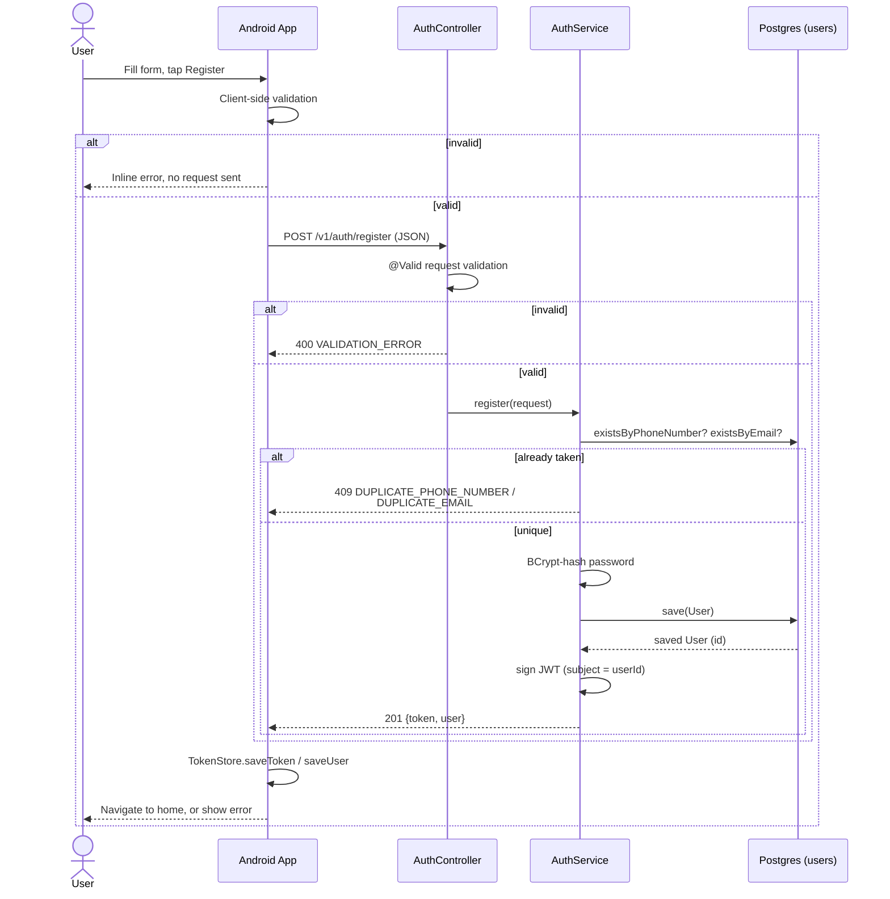
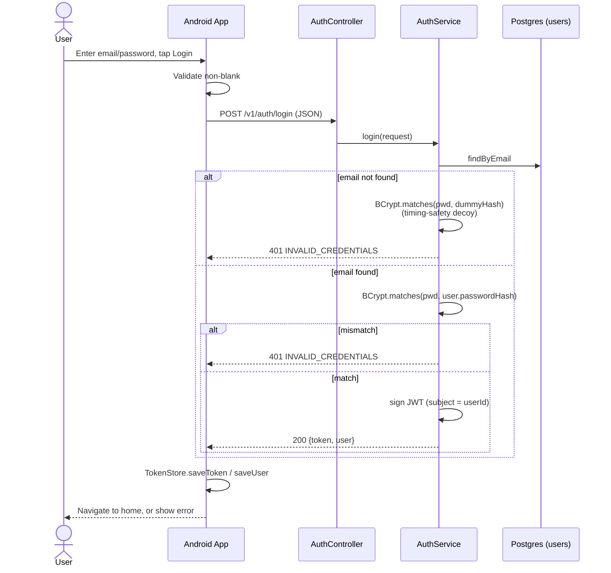
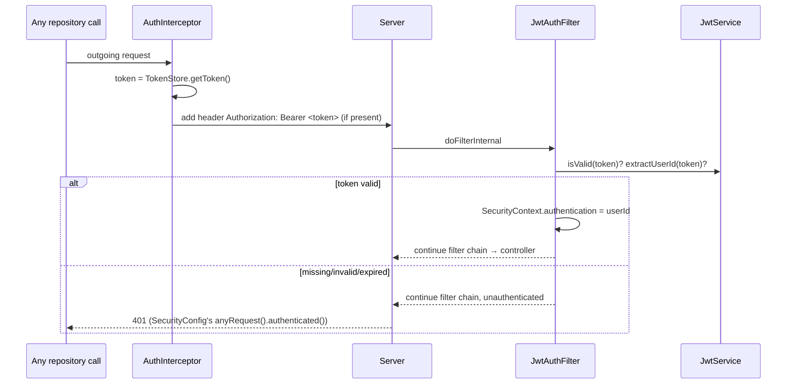

# Account Creation & Login — Specification

Describes the current, implemented behavior of registration and login across the
TrafficWatch Android client and the Kotlin/Spring Boot server. This is a
reference document (what the system does today), not a design proposal.

**Client**: `app/src/main/java/com/trafficwatch/app/{feature/auth, core/data, core/domain}`
**Server**: `server/src/main/kotlin/com/trafficwatch/server/auth`

## 1. Overview

| | Registration | Login |
|---|---|---|
| Endpoint | `POST /v1/auth/register` | `POST /v1/auth/login` |
| Auth required | No (public) | No (public) |
| Success status | `201 Created` | `200 OK` |
| Response body | `AuthResponse { token, user }` | `AuthResponse { token, user }` |

Both flows converge on the same result: a signed JWT and a `UserDto`, which the
client persists and attaches to every subsequent request.

## 2. Flow diagrams

The client-side chain (`Screen → ViewModel → UseCase → Repository → ApiService`)
is collapsed into a single "Android App" participant below — see §3.1/§4.1 for
the exact validation rules run inside it, and §6 for what `AuthRepository`
writes to `TokenStore` on success.

### 2.1 Registration



### 2.2 Login



Later, any authenticated request (e.g. `POST /v1/reports`) attaches the stored
token via `AuthInterceptor` and is validated by `JwtAuthFilter` before reaching
a controller:



## 3. Registration — detail

### 3.1 Client-side validation (`RegisterViewModel.register()`)

Order matters — first failing rule wins, sets `uiState.error`, shown via
Snackbar; request is never sent:

1. Name not blank
2. Phone number not blank; matches `^03\d{9}$` (11 digits, e.g. `03001234567`)
3. CNIC not blank; matches `^\d{13}$` (13 raw digits, no dashes)
4. Email not blank; matches `^[A-Za-z0-9+_.-]+@[A-Za-z0-9.-]+\.[A-Za-z]{2,}$`
5. Password length ≥ 8
6. Password == Confirm Password

Phone/CNIC input is digit-filtered and length-capped as the user types
(`onPhoneNumberChange`/`onCnicChange`), before the above checks ever run.

### 3.2 Server-side validation (`RegisterRequest`, `jakarta.validation`)

Re-validated independently of the client (never trust the client):

| Field | Constraint |
|---|---|
| `name` | `@NotBlank` |
| `phoneNumber` | `@Pattern(^03\d{9}$)` |
| `cnic` | `@Pattern(^\d{13}$)` |
| `email` | `@NotBlank @Email` |
| `password` | `@Size(min = 8)` |

A failure returns `400 Bad Request` with `{error: "VALIDATION_ERROR", message}`
(first field error only — see `GlobalExceptionHandler.handleValidationError`).

### 3.3 Uniqueness

- Checked via `existsByPhoneNumber` / `existsByEmail` before insert (fast,
  friendly path) — phone is checked first, so a phone conflict is reported even
  if the email is also taken.
- **Not** the sole correctness mechanism: two concurrent registrations for the
  same phone/email can both pass these checks and race to `save()`. The DB's
  unique constraints (`uq_users_phone_number`, `uq_users_email`, from
  `V1__create_users_table.sql`) are the real safety net — the losing `save()`
  throws `DataIntegrityViolationException`, caught by a fallback handler and
  turned into `409 {error: "DUPLICATE_RESOURCE"}`.
- Named conflicts (`DUPLICATE_PHONE_NUMBER` / `DUPLICATE_EMAIL`) also map to
  `409 Conflict`.

### 3.4 Password storage

`BCryptPasswordEncoder` hashes the plaintext password before it ever reaches
persistence; only `password_hash` is stored (see `V1__create_users_table.sql`).
Plaintext password never touches the `users` table or logs (`RegisterRequest`
overrides `toString()` to redact it).

### 3.5 Success response

```json
{
  "token": "<JWT>",
  "user": { "id": "<uuid>", "name": "...", "email": "..." }
}
```

`phone_number`, `cnic`, and `password` are deliberately excluded from `UserDto`
— never returned to the client after registration.

## 4. Login — detail

### 4.1 Client-side validation (`LoginViewModel.login()`)

Only checks email and password are non-blank — format/length are not
re-validated client-side (the server is the source of truth for "is this a
valid account").

### 4.2 Server-side authentication (`AuthService.login()`)

Deliberately returns the **same** error, `InvalidCredentialsException` →
`401 {error: "INVALID_CREDENTIALS"}`, whether:
- the email doesn't exist at all, or
- the email exists but the password doesn't match

This prevents a caller from enumerating which emails are registered.

**Timing side-channel closed too, not just the response body**: a real BCrypt
comparison takes ~50–100ms. If the "unknown email" path returned immediately
while the "wrong password" path always ran a comparison, response latency
alone would leak which case occurred. To prevent this, the unknown-email path
runs a throwaway `BCrypt.matches()` against a fixed `dummyPasswordHash`
(computed once at service construction) before failing, so both paths take
comparable time.

### 4.3 Success response

Identical shape to registration's success response — a fresh JWT (new
`issuedAt`/`expiration`) plus the same `UserDto`.

## 5. JWT details (`JwtService`)

- **Algorithm**: HMAC-SHA (via `Jwts.builder().signWith(key)`, `jjwt` 0.12.6).
- **Claims**: `subject` = user's UUID (string form). No roles/scopes — this API
  has no admin/moderation tier (see server README's "Open questions").
- **Expiration**: `app.jwt.expiration-days`, default 30 days.
- **Secret**: `app.jwt.secret` — **required**, no default; missing value fails
  application startup rather than running with a guessable/absent secret. Real
  secrets live only in the gitignored `application-local.yml` (dev) or CI/prod
  secret store — never committed.
- **Validation** (`JwtAuthFilter`): never throws. A missing header, malformed
  token, bad signature, or expired token all just leave the request
  unauthenticated; it is `SecurityConfig`'s `anyRequest().authenticated()` rule
  — not the filter — that turns that into an HTTP `401`.

## 6. Client-side token persistence (`TokenStore`)

Backed by Jetpack Security's `EncryptedSharedPreferences` (`AppModule.provideEncryptedSharedPreferences`), file name `trafficwatch_secure_prefs`, keyed by an `AES256_GCM` `MasterKey` — keys encrypted with `AES256_SIV`, values with `AES256_GCM`. Both the on-disk key names and values are encrypted; a device pull of the raw preferences XML shows only opaque ciphertext, not `auth_token`/`user_id`/etc. in the clear.

| Key | Value |
|---|---|
| `auth_token` | the JWT |
| `user_id`, `user_name`, `user_email` | from the last successful `AuthResponse.user` |
| `device_id` | client-generated UUID, created once and reused (used as `device_id` on report submission, unrelated to auth) |

`isLoggedIn()` is simply `getToken() != null` — there is no local expiry check;
an expired token is only discovered when a subsequent authenticated request
gets a `401` (there is currently no automatic re-login/refresh handling on that
`401` — see Open Questions).

`logout()` clears `auth_token`/`user_*` (not `device_id`, which persists across
logins on the same device).

## 7. Endpoints reachable without authentication

Per `SecurityConfig`, only these two paths bypass the JWT filter's
`authenticated()` requirement:

- `POST /v1/auth/register`
- `POST /v1/auth/login`

(Paths are matched pre-context-path, i.e. `/auth/register` inside the security
config, exposed externally as `/v1/auth/register` via `server.servlet.context-path`.)
Every other endpoint (e.g. `/v1/reports/**`) requires a valid bearer token or
returns `401`.

## 8. Open questions / known gaps

These are current, observable characteristics of the implementation worth a
future maintainer's attention — not necessarily bugs:

- **No token refresh or re-login flow.** A token simply stops working after 30
  days (or if the JWT secret rotates); the client has no code path that reacts
  to a `401` by prompting re-authentication — it would surface as a generic
  request failure wherever it occurs.
- **No account lockout / rate limiting on login.** `AuthService.login()` has no
  attempt-counting or backoff — repeated wrong-password attempts are not
  throttled at the application layer (a WAF/gateway could still apply this
  outside the app).
- **No email verification or password reset flow.** Registration immediately
  activates the account; there is no confirmation email step, and no
  "forgot password" endpoint exists yet.
- **CNIC and phone number are collected but CNIC has no uniqueness check**
  (only phone and email are enforced unique) — see `docs/superpowers/specs/2026-07-19-register-account-validation-design.md`
  for the original design rationale.
